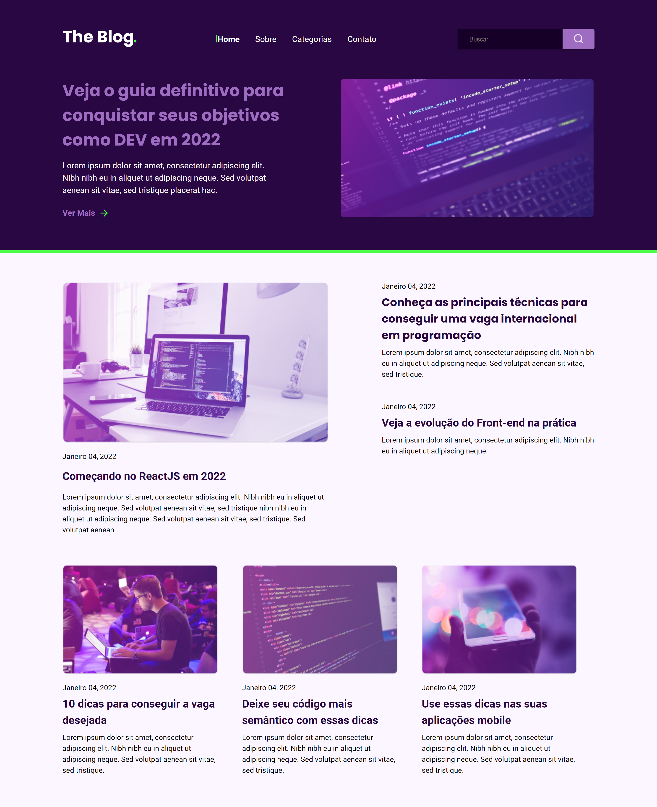

<h1 align="center"> RocketBlog </h1>

[Clique aqui para acessar](https://maik-emanoel.github.io/rocketblog/)

  <a href="#-tecnologias">Tecnologias</a>&nbsp;&nbsp;&nbsp;|&nbsp;&nbsp;&nbsp;
  <a href="#-projeto">Projeto</a>

## 🚀 Tecnologias

Esse projeto foi desenvolvido com as seguintes tecnologias:

- HTML
- CSS
- JavaScript

## 💻 Projeto

O RocketBlog é um site que simula um blog.  

Obs: Projeto construído a partir da área de desafios do Programa Discover da [Rocketseat](https://rocketseat.com.br). Após ter desenvolvido o layout proposto, adicionei novas features:

- Tornei o layout responsivo
- Adicionei algumas animações
- Criei uma função no campo pesquisar para que simulasse uma pesquisa